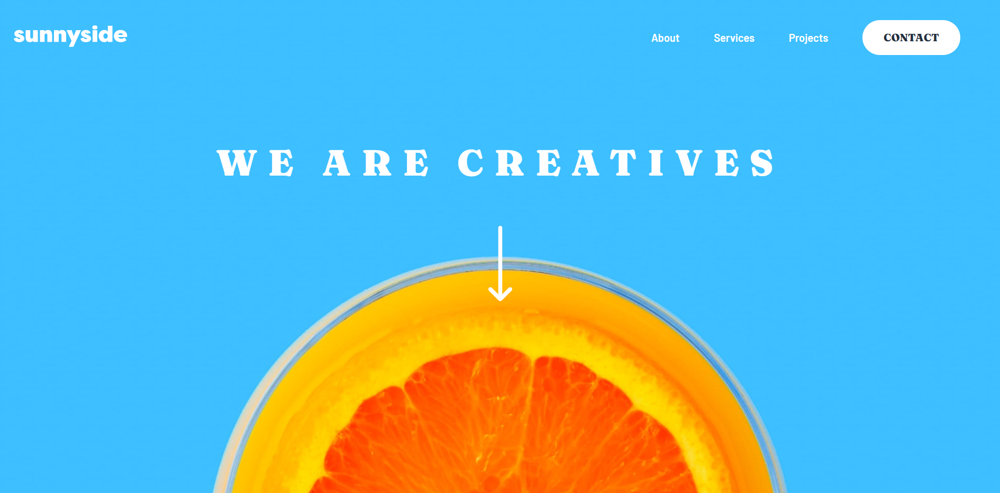
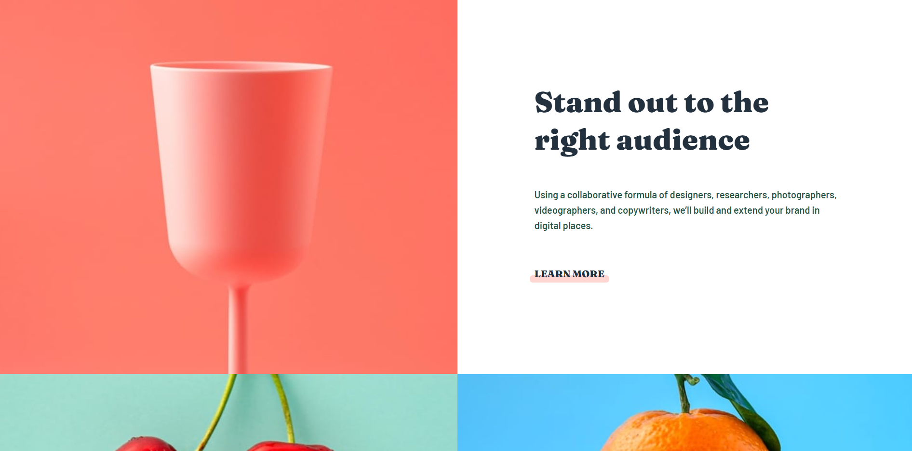
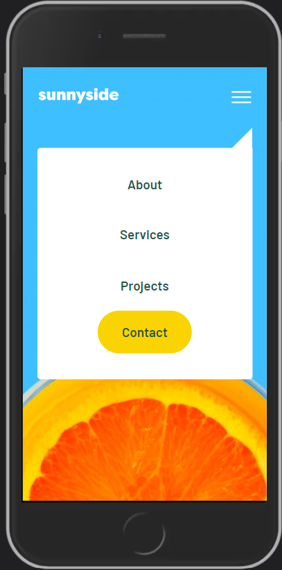

# Frontend Mentor - Sunnyside agency landing page solution

This is a solution to the [Sunnyside agency landing page challenge on Frontend Mentor](https://www.frontendmentor.io/challenges/sunnyside-agency-landing-page-7yVs3B6ef). Frontend Mentor challenges help you improve your coding skills by building realistic projects.

## Table of contents

- [Frontend Mentor - Sunnyside agency landing page solution](#frontend-mentor---sunnyside-agency-landing-page-solution)
  - [Table of contents](#table-of-contents)
  - [Overview](#overview)
    - [The challenge](#the-challenge)
    - [Screenshot](#screenshot)
    - [Links](#links)
  - [My process](#my-process)
    - [Built with](#built-with)
    - [Continued development](#continued-development)
    - [Useful resources](#useful-resources)
  - [Author](#author)
  - [Acknowledgments](#acknowledgments)

## Overview

### The challenge

Users should be able to:

- View the optimal layout for the site depending on their device's screen size
- See hover states for all interactive elements on the page

### Screenshot

### Links

- Solution URL: [[Add solution URL here](https://github.com/zharifzakaria/sunnyside-agency-landing-page)](https://github.com/zharifzakaria/sunnyside-agency-landing-page)
- Live Site URL: [[Add live site URL here](https://zharifzakaria.github.io/sunnyside-agency-landing-page/)](https://zharifzakaria.github.io/sunnyside-agency-landing-page/)

## My process

### Built with

- Semantic HTML5 markup
- CSS custom properties
- Flexbox
- CSS Grid
- Mobile-first workflow

### Continued development

### Useful resources

## Author
- Frontend Mentor - [@zharifzakaria](https://www.frontendmentor.io/profile/zharifzakaria)

## Acknowledgments

Thanks!
